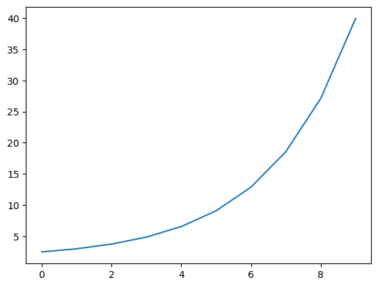

# Bridge widget helpers


<!-- WARNING: THIS FILE WAS AUTOGENERATED! DO NOT EDIT! -->

This module provides low-level infrastructure for Bridget: - **JS
Bundling**: Concatenate and transform JavaScript sources - **Blocking
Operations**: Block Python execution while allowing UI interaction -
**AnyWidget Base**:
[`BridgeWidget`](https://civvic.github.io/bridget/bridge_widget.html#bridgewidget)
class for bidirectional messaging

<!-- # Prologue -->

# VFile System

Hacking around to get anywidget `vfile:` working in Script and Style.
Unfortunately, it’s not a public API. If useful, we could write a
similar util for Bridget.

NOTE: `%load_ext anywidget` must have been previously run for this to
work

------------------------------------------------------------------------

<a
href="https://github.com/civvic/bridget/blob/main/bridget/bridge_widget.py#L60"
target="_blank" style="float:right; font-size:smaller">source</a>

### read_vfile

>  read_vfile (cts:str)

## vfile: Components

> **FastHTML** xtend `Script` and `Style` with `vfile:` support.

------------------------------------------------------------------------

<a
href="https://github.com/civvic/bridget/blob/main/bridget/bridge_widget.py#L75"
target="_blank" style="float:right; font-size:smaller">source</a>

### StyleV

>  StyleV (*c, id=None, cls=None, title=None, style=None, attrmap=None,
>              valmap=None, ft_cls=None, **kwargs)

*A Style w/ code or `vfile:` contents that doesn’t escape its code*

<table>
<thead>
<tr>
<th></th>
<th><strong>Type</strong></th>
<th><strong>Default</strong></th>
<th><strong>Details</strong></th>
</tr>
</thead>
<tbody>
<tr>
<td>c</td>
<td>VAR_POSITIONAL</td>
<td></td>
<td></td>
</tr>
<tr>
<td>id</td>
<td>NoneType</td>
<td>None</td>
<td></td>
</tr>
<tr>
<td>cls</td>
<td>NoneType</td>
<td>None</td>
<td></td>
</tr>
<tr>
<td>title</td>
<td>NoneType</td>
<td>None</td>
<td></td>
</tr>
<tr>
<td>style</td>
<td>NoneType</td>
<td>None</td>
<td></td>
</tr>
<tr>
<td>attrmap</td>
<td>NoneType</td>
<td>None</td>
<td></td>
</tr>
<tr>
<td>valmap</td>
<td>NoneType</td>
<td>None</td>
<td></td>
</tr>
<tr>
<td>ft_cls</td>
<td>NoneType</td>
<td>None</td>
<td></td>
</tr>
<tr>
<td>kwargs</td>
<td>VAR_KEYWORD</td>
<td></td>
<td></td>
</tr>
<tr>
<td><strong>Returns</strong></td>
<td><strong>FT</strong></td>
<td></td>
<td><strong>type: ignore</strong></td>
</tr>
</tbody>
</table>

------------------------------------------------------------------------

<a
href="https://github.com/civvic/bridget/blob/main/bridget/bridge_widget.py#L70"
target="_blank" style="float:right; font-size:smaller">source</a>

### ScriptV

>  ScriptV (code:str='', id=None, cls=None, title=None, style=None,
>               attrmap=None, valmap=None, ft_cls=None, **kwargs)

*A Script w/ code or `vfile:` contents that doesn’t escape its code*

<table>
<thead>
<tr>
<th></th>
<th><strong>Type</strong></th>
<th><strong>Default</strong></th>
<th><strong>Details</strong></th>
</tr>
</thead>
<tbody>
<tr>
<td>code</td>
<td>str</td>
<td></td>
<td></td>
</tr>
<tr>
<td>id</td>
<td>NoneType</td>
<td>None</td>
<td></td>
</tr>
<tr>
<td>cls</td>
<td>NoneType</td>
<td>None</td>
<td></td>
</tr>
<tr>
<td>title</td>
<td>NoneType</td>
<td>None</td>
<td></td>
</tr>
<tr>
<td>style</td>
<td>NoneType</td>
<td>None</td>
<td></td>
</tr>
<tr>
<td>attrmap</td>
<td>NoneType</td>
<td>None</td>
<td></td>
</tr>
<tr>
<td>valmap</td>
<td>NoneType</td>
<td>None</td>
<td></td>
</tr>
<tr>
<td>ft_cls</td>
<td>NoneType</td>
<td>None</td>
<td></td>
</tr>
<tr>
<td>kwargs</td>
<td>VAR_KEYWORD</td>
<td></td>
<td></td>
</tr>
<tr>
<td><strong>Returns</strong></td>
<td><strong>FT</strong></td>
<td></td>
<td><strong>type: ignore</strong></td>
</tr>
</tbody>
</table>

## anysource

------------------------------------------------------------------------

<a
href="https://github.com/civvic/bridget/blob/main/bridget/bridge_widget.py#L90"
target="_blank" style="float:right; font-size:smaller">source</a>

### anysource

>  anysource (*args:str|pathlib.Path|__main__.SourceProvider)

*Read and join text from files, vfiles or strings*

------------------------------------------------------------------------

<a
href="https://github.com/civvic/bridget/blob/main/bridget/bridge_widget.py#L81"
target="_blank" style="float:right; font-size:smaller">source</a>

### SourceProvider

>  SourceProvider (*args, **kwargs)

*Object with a .source attribute (string or callable returning string)*

``` python
class Src:
    source = 'c'
test_eq(anysource('a', '', 'b', Src()), 'a\nb\nc')
```

# Bundling utilities

> Very basic JS bundler. Only concat and basic import transformation for
> now.

Two variants: async for use with `await`, sync for direct calls.  
The sync version uses `from_thread` to handle async operations.

``` python
async def bundled(*sources, debugger=False, command:str|None=None, **kwargs):
    "Concat javascript `sources`. Optionally, first run command."
    if command:
        try:
            _, stderr = await arun_command(command, **kwargs)
        except Exception as e:
            stderr = str(e)
        if stderr: raise RuntimeError(stderr)
    if debugger: return anysource('debugger;', *sources)
    return anysource(*sources)
```

``` python
test_eq(await bundled('a'), 'a')
with test_raises(FileNotFoundError):
    await bundled(Path('not_found.js'))
with test_raises(RuntimeError):
    await bundled(command='ls', cwd=Path('/not/found'))
test_eq(await bundled(command='ls', debugger=True), 'debugger;')
```

``` python
with tempfile.NamedTemporaryFile('w') as fp:
    fp.write('a')
    fp.seek(0)
    test_eq(await bundled(Path(fp.name)), 'a')
```

``` python
def bundled(*sources, debugger=False, command:str|None=None, **kwargs):
    "Concat javascript `sources`. Run `command` first if not None."
    async def _run(): return await arun_command(command, **kwargs)  # type: ignore
    if command:
        with from_thread.start_blocking_portal() as portal: 
            try: _, stderr = portal.call(_run)
            except Exception as e: stderr = str(e)
            if stderr: raise RuntimeError(stderr)
    if debugger: return anysource('debugger;', *sources)
    return anysource(*sources)
```

``` python
test_eq(bundled('a'), 'a')
with test_raises(FileNotFoundError):
    bundled(Path('not_found.js'))
with test_raises(RuntimeError):
    bundled(command='ls', cwd=Path('/not/found'))
test_eq(bundled(command='ls', debugger=True), 'debugger;')
```

``` python
with tempfile.NamedTemporaryFile('w') as fp:
    fp.write('a')
    fp.seek(0)
    test_eq(bundled(Path(fp.name)), 'a')
```

``` python
#  ./node_modules/.bin/esbuild --bundle --format=esm --outdir=bridget/js nbs/js/logger.js
```

------------------------------------------------------------------------

<a
href="https://github.com/civvic/bridget/blob/main/bridget/bridge_widget.py#L148"
target="_blank" style="float:right; font-size:smaller">source</a>

### bundled

>  bundled (*sources:str|Path, bundle:bool=True, bundler:str='copy',
>               outdir:str|Path|None=None, command:str|None=None, **kwargs)

<table>
<thead>
<tr>
<th></th>
<th><strong>Type</strong></th>
<th><strong>Default</strong></th>
<th><strong>Details</strong></th>
</tr>
</thead>
<tbody>
<tr>
<td>sources</td>
<td>str | Path</td>
<td></td>
<td>type: ignore</td>
</tr>
<tr>
<td>bundle</td>
<td>bool</td>
<td>True</td>
<td></td>
</tr>
<tr>
<td>bundler</td>
<td>str</td>
<td>copy</td>
<td></td>
</tr>
<tr>
<td>outdir</td>
<td>str | Path | None</td>
<td>None</td>
<td></td>
</tr>
<tr>
<td>command</td>
<td>str | None</td>
<td>None</td>
<td></td>
</tr>
<tr>
<td>kwargs</td>
<td>VAR_KEYWORD</td>
<td></td>
<td></td>
</tr>
</tbody>
</table>

------------------------------------------------------------------------

<a
href="https://github.com/civvic/bridget/blob/main/bridget/bridge_widget.py#L95"
target="_blank" style="float:right; font-size:smaller">source</a>

### Bundle

>  Bundle (*sources:str|pathlib.Path, bundle:bool=True, bundler:str='copy',
>              outdir:str|pathlib.Path|None=None, command:str|None=None,
>              **cmd_kw)

*Basic JS bundler class.*

<table>
<colgroup>
<col style="width: 6%" />
<col style="width: 25%" />
<col style="width: 34%" />
<col style="width: 34%" />
</colgroup>
<thead>
<tr>
<th></th>
<th><strong>Type</strong></th>
<th><strong>Default</strong></th>
<th><strong>Details</strong></th>
</tr>
</thead>
<tbody>
<tr>
<td>sources</td>
<td>str | pathlib.Path</td>
<td></td>
<td>javascript source</td>
</tr>
<tr>
<td>bundle</td>
<td>bool</td>
<td>True</td>
<td>Bundle using <code>bundler</code> with sources as entry points</td>
</tr>
<tr>
<td>bundler</td>
<td>str</td>
<td>copy</td>
<td>Bundler type to use, one of ‘esbuild’, ‘copy’</td>
</tr>
<tr>
<td>outdir</td>
<td>str | pathlib.Path | None</td>
<td>None</td>
<td>Output directory for bundled files</td>
</tr>
<tr>
<td>command</td>
<td>str | None</td>
<td>None</td>
<td>Run <code>command</code> first if not None</td>
</tr>
<tr>
<td>cmd_kw</td>
<td>VAR_KEYWORD</td>
<td></td>
<td></td>
</tr>
</tbody>
</table>

``` python
(f1 := Path('./js/b.js')).write_text('B');
```

``` python
bnd1 = bundled('a', f1, 'c')
test_eq(bnd1.sources, ('a', f1, 'c'))
test_eq(bnd1.bundled_sources, ('a', bnd1.outdir/ f1.name, 'c'))
test_eq(bnd1.source, 'a\nB\nc')
test_eq(bnd1(), 'a\nB\nc')
f2 = Path(bnd1.bundled_sources[1])

src = 'js/test.js'
bnd2 = bundled(Path(src))
test_eq(bnd2.bundled_sources[0], bundle_path('bridget')/src)
test_eq(bnd2.bundled_sources[0].read_text(), Path(src).read_text())  # type: ignore
f3 = Path(bnd2.bundled_sources[0])
test_eq(bnd2.bundle_path_of(src), f3)

prj_root = Path().resolve().parent
Path(src).resolve().relative_to(prj_root), f3.relative_to(prj_root)
```

    (Path('nbs/js/test.js'), Path('bridget/js/test.js'))

[`Bundle`](https://civvic.github.io/bridget/bridge_widget.html#bundle)(…),
or
[`bundled`](https://civvic.github.io/bridget/bridge_widget.html#bundled)(…),
works lazily, it simply create the bundle instance. It won’t move,
transform, or aggregate files until you explicitly call it (or retrieve
`source` or `bundled_sources`):

`bundled(..., bundle=True,bundler='copy').bundled_sources`, the default,
will just copy the sources to the outdir

``` python
with tempfile.NamedTemporaryFile('w', suffix='.js', dir='./js') as fp:
    (p := Path(fp.name)).write_text('asdfgh')
    bndl = bundled(p, bundler='esbuild')
    test_is('asdfgh' in bndl(), True)
    bndl.bundled_sources[0].unlink()  # type: ignore

bnd3 = bundled(f1, Path(src), bundler='esbuild')
test_eq(bnd3.bundled_sources, (bnd3.outdir/ f1.name, bundle_path('bridget')/src))
test_is(r'stripAnsi("\x1B[4mBridget\x1B[0m")' in bnd3(), True)
f3 = Path(bnd3.bundled_sources[1])

Path(src).resolve().relative_to(prj_root), f3.relative_to(prj_root)
```

    (Path('nbs/js/test.js'), Path('bridget/js/test.js'))

`bundled(..., bundle=True,bundler='esbuild').bundled_sources` will
bundle each Path in `sources` as entry point.

``` python
with test_raises(ValueError):
    bundled(Path('not_found.js'), bundler='esbuild')()
with test_raises(FileNotFoundError):
    bundled(bundler='esbuild', command='ls', cwd=Path('/not/found'))()
```

``` python
bnd4 = bundled('import {a,b,c} from "./js/d.js"')
test_eq(bnd4.source, 'import {a,b,c} from "./js/d.js"')

test_eq(bnd4(), 'const {a, b, c} = await brdimport("./js/d.js");')
```

Note that `source` and `__call__` are not the same.

`source` will simply concatenate all the bundled sources.

`__call__` can bundled additional sources (string or another
[`Bundle`](https://civvic.github.io/bridget/bridge_widget.html#bundle))
and will tranform the final source. This is what you should use as the
`_esm` of AnyWidgets.

``` python
test_eq(bundled(command='ls')(debugger=True), 'debugger;')

src = bundled()(debugger=True, ts=True)
print(src)
test_is('debugger;  // ' in src, True)

src = bundled('import a from "b"')(debugger=True)
test_eq(src, 'debugger;\nconst {default: a} = await brdimport("b");')
print(src)

src = bnd3('// a;', debugger=True)
cprint(src)
```

    debugger;  // 1764771018.388513
    debugger;
    const {default: a} = await brdimport("b");

<pre style="white-space:pre;overflow-x:auto;line-height:normal;font-family:Menlo,'DejaVu Sans Mono',consolas,'Courier New',monospace">debugger;
<span style="color: #800080; text-decoration-color: #800080">//</span> a;
<span style="color: #800080; text-decoration-color: #800080">//</span> nbs/js/b.js
B;
&#10;<span style="color: #800080; text-decoration-color: #800080">//</span> nbs/js/test.js
debugger;
var stripAnsi = <span style="color: #800080; text-decoration-color: #800080; font-weight: bold">require_strip_ansi</span><span style="font-weight: bold">()</span>;
function <span style="color: #800080; text-decoration-color: #800080; font-weight: bold">test</span><span style="font-weight: bold">()</span> <span style="font-weight: bold">{</span>
  <span style="color: #800080; text-decoration-color: #800080; font-weight: bold">console.log</span><span style="font-weight: bold">(</span><span style="color: #008000; text-decoration-color: #008000">"test() called"</span><span style="font-weight: bold">)</span>;
  <span style="color: #800080; text-decoration-color: #800080; font-weight: bold">console.log</span><span style="font-weight: bold">(</span><span style="color: #800080; text-decoration-color: #800080; font-weight: bold">stripAnsi</span><span style="font-weight: bold">(</span><span style="color: #008000; text-decoration-color: #008000">"\x1B[4mBridget\x1B[0m"</span><span style="font-weight: bold">))</span>;
<span style="font-weight: bold">}</span>
var test_default = test;
export <span style="font-weight: bold">{</span>
  test_default as default
<span style="font-weight: bold">}</span>;
&#10;</pre>

``` python
for f in (f1, f2, f3): f.unlink(True)
```

> Resolve a JavaScript module specifier relative to a base path.

Given a string containing a module specifier like the ones used in JS
`import` declarations or `dynamic import()`, returns an absolute URL or
a local `Path` to an existing file.

[the HTML
spec](https://html.spec.whatwg.org/multipage/webappapis.html#resolve-a-module-specifier)  
[MDN](https://developer.mozilla.org/en-US/docs/Web/JavaScript/Reference/Statements/import#module_specifier_resolution)

``` python
show(DetailsJSON(bridge_cfg.as_dict(), summary='Bridget Config'))
```

<style>details ul { list-style-type:none; list-style-position: outside; padding-inline-start: 22px; margin: 0; } details .string { color: #24837b; } details .string::before { content: "'"; } details .string::after { content: "'"; } details .number { color: #ad8301; } details .true { color: blue; } details .false { color: red; } details .null { color: gray; } span.n { color: darkgrey; } </style>
<details open><summary>Bridget Config
</summary>  <ul>
    <li>
<span><span class="n">auto_show</span>: <span class="v false">False</span></span>    </li>
    <li>
<span><span class="n">auto_mount</span>: <span class="v false">False</span></span>    </li>
    <li>
<span><span class="n">auto_id</span>: <span class="v false">False</span></span>    </li>
    <li>
<span><span class="n">bundle_cfg</span>: <span class="v ">{&#x27;out_dir&#x27;: [Path(&#x27;/Users/vic/dev/repo/project/bridget/nbs/js&#x27;), Path(&#x27;/Users/vic/dev/repo/project/bridget/nbs&#x27;), Path(&#x27;/Users/vic/dev/repo/…</span></span>    </li>
    <li>
<span><span class="n">bootstrap</span>: <span class="v false">False</span></span>    </li>
    <li>
<span><span class="n">current_did</span>: <span class="v null">None</span></span>    </li>
  </ul>
</details>

``` python
cprint(bridge_cfg.bundle_cfg.out_dir)
```

``` python
if BUNDLE_PATH.resolve() not in (cfg := bridge_cfg.bundle_cfg).out_dir:
    cfg.update(out_dir=[BUNDLE_PATH, *cfg.out_dir])
cprint(bridge_cfg.bundle_cfg.out_dir)
```

By default, Bridget looks for JS files in: - the python bundle, if it
can be determined (use `bridge_cfg.for_module(...)`) -
`nbdev.config.get_config().lib_path` / ‘js’ and
`nbdev.config.get_config().lib_path` / ‘js’, if found - `Path.cwd()` and
`Path.cwd()`/‘js’ at time of call

More locations can be added by modifying the `out_dir` of the
`bundle_cfg` object.

------------------------------------------------------------------------

<a
href="https://github.com/civvic/bridget/blob/main/bridget/bridge_widget.py#L167"
target="_blank" style="float:right; font-size:smaller">source</a>

### resolve_ESM

>  resolve_ESM (spec:str, base:str|pathlib.Path|None=None)

*Resolve a JavaScript module specifier relative to `base` or
`bundle_cfg.out_dir`.*

``` python
test_eq(resolve_ESM('./non-existent.js'), None)
test_eq(resolve_ESM('/non-existent.js'), None)
test_eq(resolve_ESM('./bridge.js'), Path('./js/bridge.js').resolve())
```

Test relative specifiers (these will depend on actual files existing)

``` python
test_eq(resolve_ESM('asdfretgs'), None)
test_eq(resolve_ESM('asdfretgs:wrwteryeyt'), None)

result = cast(ParseResult, resolve_ESM('https://unpkg.com/htmx.org@next/dist/htmx.js'))
test_eq(result.scheme, 'https')
test_eq(result.netloc, 'unpkg.com')

result = cast(ParseResult, resolve_ESM('data:text/javascript,export default 42;'))
test_eq(result.scheme, 'data')

test_eq(resolve_ESM('file:///path/to/x.js'), None)
test_eq(resolve_ESM('FILE:///observer.js', Path('./js')), Path('js/observer.js'))
```

``` python
# result = resolve_ESM('data:application/json,{"foo":42}', { type="json" })
# test_eq(result.scheme, 'data')
```

Absolute specifiers (URLs)

``` python
test_eq(resolve_ESM('lodash'), None)
test_eq(resolve_ESM('observer.js', Path('./js')), None)
```

Test bare specifiers (TBD, not yet supported)

Look up for JS files in well-known locations and return the contents

------------------------------------------------------------------------

<a
href="https://github.com/civvic/bridget/blob/main/bridget/bridge_widget.py#L177"
target="_blank" style="float:right; font-size:smaller">source</a>

### get_ESM

>  get_ESM (module_spec)

*Contents of a JS module*

``` python
test_eq(get_ESM('lodash'), None)
test_eq(get_ESM('./test.js'), Path('./js/test.js').read_text())
test_eq(get_ESM('https://a'), 'https://a')
```

``` python
with tempfile.NamedTemporaryFile('w', dir='./js') as fp:
    p = Path(fp.name)
    p.write_text('import {a} from "b"')
    n = f"/{p.relative_to(Path('./js').resolve())}"
    test_eq(get_ESM(n), 'const {a} = await brdimport("b");')
```

# BlockingWidget

## JS -\> Python

``` python
class Cons(anywidget.AnyWidget):
    _esm = '''
export default {
  async initialize({ model, experimental }) {
    model.on("msg:custom", async (cmd) => {
      const { kind, msg, timeout } = cmd;
      if (kind === 'brd-command') {
        let [res, buffers] = await experimental.invoke("_upper", msg, {signal: AbortSignal.timeout(timeout)});
        console.log(res);
      } else console.log(cmd);
    }); 
  },
};
'''
    @anywidget.experimental.command  # type: ignore
    def _upper(self, msg, buffers):
        # print(f'{msg=} {buffers=}')
        return msg.upper(), buffers
    
    def to_console(self, msg):
        self.send({'kind': 'brd-command', 'msg': msg, 'timeout': 5e3})
```

``` python
from bridget.helpers import find_active_widgets, get_kernel_widgets_comms, get_active_widgets_comms
```

``` python
ww = find_active_widgets()
ww
```

    []

``` python
w = Cons()
```

``` python
w.to_console('Hello, worlds!')
```

The (still) experimental `invoke` feature of `AnyWidget` allows for
blocking operations frontend-backend.  
We’ll also need the other way around, but that’s is surprisingly more
involved.

## Python -\> JS

``` python
from matplotlib import pyplot as plt
import numpy as np
```

``` python
base = 1.5
fig = plt.figure()#figsize=(4, 2.67))
plt.plot(base + base**np.arange(10));
```



------------------------------------------------------------------------

<a
href="https://github.com/civvic/bridget/blob/main/bridget/bridge_widget.py#L184"
target="_blank" style="float:right; font-size:smaller">source</a>

### exp_backoff

>  exp_backoff (base:float=1.552, max_value:float=10.0)

*Exponential backoff generator of values until cumulative value is
max_value, then yields 0 and stops.*

``` python
list(itertools.takewhile(lambda t: t, exp_backoff()))
```

    [1.552, 2.408704, 3.7383086080000005, 2.3009873919999997]

``` python
list(itertools.takewhile(lambda t: t, exp_backoff(max_value=60)))
```

    [1.552,
     2.408704,
     3.7383086080000005,
     5.8018549596160005,
     9.004478897324033,
     13.9749512486469,
     21.68912433789999,
     1.8305779485130742]

``` python
list(itertools.takewhile(lambda t:t, exp_backoff(0.4, 3)))
```

    [0.4, 0.8, 1.2000000000000002, 0.5999999999999996]

``` python
list(itertools.takewhile(lambda t:t, exp_backoff(1*0.0776, 1)))
```

    [0.0776, 0.1552, 0.2328, 0.3104, 0.22399999999999998]

``` python
boff = iter(exp_backoff())
t, sum = 1, 0
while t:
    sum += (t := next(boff))
    print(f"t: {t:0.4f} sum: {sum:0.4f}")
```

    t: 1.5520 sum: 1.5520
    t: 2.4087 sum: 3.9607
    t: 3.7383 sum: 7.6990
    t: 2.3010 sum: 10.0000
    t: 0.0000 sum: 10.0000

``` python
tm = 5.0
boff = iter(exp_backoff(tm*0.1, tm))
t, sum = 1, 0
while t:
    sum += (t := next(boff))
    print(f"t: {t:0.4f} sum: {sum:0.4f}")
```

    t: 0.5000 sum: 0.5000
    t: 1.0000 sum: 1.5000
    t: 1.5000 sum: 3.0000
    t: 2.0000 sum: 5.0000
    t: 0.0000 sum: 5.0000

``` python
class BlockingMixin(W.Widget):
    "A mixin for widgets that supports blocking custom messages with the front-end."
    _cbs: CallbackDispatcher

    def on_msg(self, cb, remove=False):
        if not hasattr(self, '_cbs'): self._cbs = CallbackDispatcher()
        self._cbs.register_callback(cb, remove=remove)
        super().on_msg(cb, remove=remove)

    def send(self, msg, timeout: float|None=None, buffers=None, 
            sleep: float = 1/15, n: int = 10, show: Callable[[bool], None]|None = None
    ) -> tuple[Any|Empty, Any|Empty]|None:
        "Send `msg` to the front-end. If `timeout` seconds is not None, calling blocks."
        if timeout is None: 
            for cb in self._cbs.callbacks: super().on_msg(cb)
            return super().send(msg, buffers)
        for cb in self._cbs.callbacks: super().on_msg(cb, remove=True)
        res = self._send_msg(msg, buffers,timeout, sleep, n, show)
        # NOTE: restoring normal callbacks now implies that front-end can yet send back a result
        # even if python timeout was triggered.
        for cb in self._cbs.callbacks: super().on_msg(cb)
        return res
    
    async def asend(self, msg, timeout: float=5.0, buffers=None, 
            sleep: float = 1/15, n: int = 10, show: Callable[[bool], None]|None = None
    ) -> tuple[Any|Empty, Any|Empty]|None:
        "Send `msg` to the front-end. Call will end after `timeout` seconds if `timeout` is not None."
        for cb in self._cbs.callbacks: super().on_msg(cb, remove=True)
        res = await self._asend_msg(msg, buffers, timeout, sleep, n, show)
        for cb in self._cbs.callbacks: super().on_msg(cb)
        return res

    def _send_msg(self, msg, buffers=None, timeout: float = 5.0, 
            sleep: float = 1/15, n: int = 10, show: Callable[[bool], None]|None = None
    ) -> tuple[Any|Empty, Any|Empty]:
        "Send blocking `msg` to the front-end. Return response tuple (content, buffers), or (empty, empty) if `timeout`."
        boff = iter(exp_backoff(timeout*0.776, timeout))
        timeout, start_time = next(boff), time.time()
        result = None
        def _on_msg(_, msg, buffers):
            nonlocal result
            if result is None: result = (msg, buffers)
        super().on_msg(_on_msg)  # register transient callback
        try:
            super().send(msg, buffers)
            with ui_events() as ui_poll:
                while True:
                    if sleep: time.sleep(sleep)
                    ui_poll(n)
                    if (time.time() - start_time) > timeout:
                        timeout, start_time = next(boff), time.time()
                        if not timeout: result = (empty, empty)
                    if result is not None:
                        content, buffers = result
                        if content is empty: return (empty, empty)
                        self._cbs(self, content, buffers)
                        return content, buffers
                    if show: show(False)
        except Exception as e:
            if isinstance(e, RuntimeError): raise
            raise RuntimeError(f"Error during message processing: {str(e)}") from e
        finally:
            super().on_msg(_on_msg, True)  # unregister callback
            if show: show(True)

    async def _asend_msg(self, msg, buffers=None, timeout: float = 5.0, 
            sleep: float = 1/15, n: int = 10, show: Callable[[bool], None]|None = None
    ) -> tuple[Any|Empty, Any|Empty]:
        "Send async `msg` to the front-end. Return response tuple (content, buffers), or (empty, empty) if `timeout`."
        boff = iter(exp_backoff(timeout*0.776, timeout))
        timeout, start_time = next(boff), time.time()
        result = None
        def _on_msg(w, msg, buffers):
            nonlocal result
            if result is None: result = (msg, buffers)
        super().on_msg(_on_msg)
        try:
            super().send(msg, buffers)
            async with ui_events() as ui_poll:
                while True:
                    await ui_poll(10)
                    if (time.time() - start_time) > timeout:
                        timeout, start_time = next(boff), time.time()
                        if not timeout: result = (empty, empty)
                    if result is not None:
                        content, buffers = result
                        if content is empty: return (empty, empty)
                        self._cbs(self, content, buffers)
                        return (content, buffers)
                    if sleep: await anyio.sleep(sleep)
                    if show: show(False)
        except Exception as e:
            if isinstance(e, RuntimeError): raise
            raise RuntimeError(f"Error during message processing: {str(e)}") from e
        finally:
            super().on_msg(_on_msg, True)
            if show: show(True)
```

### blocks

> functions to block until a condition is met without blocking front-end
> interaction.

------------------------------------------------------------------------

<a
href="https://github.com/civvic/bridget/blob/main/bridget/bridge_widget.py#L247"
target="_blank" style="float:right; font-size:smaller">source</a>

### blocking

>  blocking (timeout:float=1, sleep:float=0.2, n:int=10,
>                show:Optional[Callable[[bool],NoneType]]=None)

------------------------------------------------------------------------

<a
href="https://github.com/civvic/bridget/blob/main/bridget/bridge_widget.py#L226"
target="_blank" style="float:right; font-size:smaller">source</a>

### ablocks

>  ablocks (pred:Callable[...,bool], timeout:float=1, sleep:float=0.2,
>               n:int=10, show:Optional[Callable[[bool],NoneType]]=None)

*Return True when `pred` returns True, or False when at least `timeout`
seconds have passed.*

------------------------------------------------------------------------

<a
href="https://github.com/civvic/bridget/blob/main/bridget/bridge_widget.py#L204"
target="_blank" style="float:right; font-size:smaller">source</a>

### blocks

>  blocks (pred:Callable[...,bool], timeout:float=1, sleep:float=0.2,
>              n:int=10, show:Optional[Callable[[bool],NoneType]]=None)

*Block until `pred` is True, or at least `timeout` seconds have passed.
Return `False` if timeout.*

``` python
class Cnt:
    def __init__(self, n=10, sleep=0.0): self.n, self.sleep, self.cnt = n, sleep, 0
    def __call__(self):
        self.cnt += 1
        time.sleep(self.sleep)
        return self.cnt > self.n-1

blocks(cntr := Cnt(10), n=20, sleep=0.1, show=_show)
test_eq(cntr.cnt, 10)
```

    ._.

``` python
done = await ablocks(cntr := Cnt(10, 0.2), show=_show)
if done: test_eq(cntr.cnt, 10)
else: print('timeout')
```

    ._.
    timeout

``` python
with blocking(n=20, sleep=0.0, show=_show) as pred:
    cntr = Cnt(10)
    test_is(pred(cntr), True)
    test_eq(cntr.cnt, 10)
```

    ._.

``` python
with blocking(show=_show) as pred:
    cntr = Cnt(10, 0.2)
    done = pred(cntr)
    if done: test_eq(cntr.cnt, 10)
    else: print('timeout')
```

    ._.
    timeout

------------------------------------------------------------------------

<a
href="https://github.com/civvic/bridget/blob/main/bridget/bridge_widget.py#L256"
target="_blank" style="float:right; font-size:smaller">source</a>

### BlockingMixin

>  BlockingMixin (**kwargs)

*Mixin for widgets that supports blocking custom messages with the
front-end.*

``` python
class BlockingWidget(anywidget.AnyWidget, BlockingMixin):
    _esm = anysource('// debugger;', '''
    export default { 
        async initialize({ model }) {
            function on_msg(msg) {
                console.log(`Received message:`, msg);
                if (!msg?.timeout) return model.send({ msg_id: msg.msg_id, response: 'no timeout' });
                (function loop(n) {
                    setTimeout(() => {
                        n += 100
                        if (n > msg.timeout*1000) {
                            console.log(`Sending response for msg_id:`, msg.msg_id);
                            model.send({ msg_id: msg.msg_id, response: 'done waiting', error: null });
                            return;
                        }
                        // console.log('.');
                        loop(n);
                    }, 100);
                })(0);
            }
            model.on("msg:custom", on_msg);
            setTimeout(() => {
                console.log(`Initialized.`);
                model.set('_loaded', true); model.save_changes();
            }, 1000);
        }
    };
    ''')

    def test_send(self, msg, buffers=None, *, timeout: float|None=None, 
            sleep: float = 1/15, n: int = 10, show: Callable[[bool], None]|None = None):
        self._start_time = time.time()
        print(f'Sending message {msg}...')
        res = self.send(msg, buffers, timeout=timeout, sleep=sleep, n=n, show=show)
        return None if res == (empty, empty) else res
    
    async def test_asend(self, msg, buffers=None, *, timeout: float=5.0, 
        sleep: float = 1/15, n: int = 10, show: Callable[[bool], None]|None = None
    ):
        self._start_time = time.time()
        print(f'Sending message {msg}...')
        res = await self.asend(msg, buffers, timeout=timeout, sleep=sleep, n=n, show=show)
        return None if res == (empty, empty) else res

    def __init__(self, *args, **kwargs):
        # self.setup_init_on_msg(self._handle_message)
        self.on_msg(self._handle_message)
        super().__init__(*args, **kwargs)
        print('Initializing...')

    def _handle_message(self, _, msg, buffers):
        e = time.time()
        self._last_message = e, msg
        print(f'\nelapsed: {e-self._start_time:.3f}s Received message: {msg}, buffers: {buffers}')
```

``` python
cleanupwidgets('w')

w = BlockingWidget()
test_eq(w.loaded(), False)
```

    Initializing...

``` python
idx = kounter('blocking')
print(idx)
w.test_send({'msg_id': idx})
```

    1
    Sending message {'msg_id': 1}...

``` python
cleanupwidgets('w')

w = BlockingWidget.create(show=_show, sleep=0.1)
print(f'loaded={w.loaded()}')
test_eq(w.loaded(), True)
```

    Initializing...
    ._.
    loaded=True

``` python
idx = kounter('blocking')
a = w.test_send({'msg_id': idx, 'timeout': 2}, timeout=1, show=_show)
print(f"{idx=} ->", f"Timeout {time.time()-w._start_time:3f}" if not a else f"{a=}")
test_is(a, None)
```

    Sending message {'msg_id': 2, 'timeout': 2}...
    ._.
    idx=2 -> Timeout 1.162399

``` python
idx = kounter('blocking')
a = w.test_send({'msg_id': idx, 'timeout': 2}, timeout=3, show=_show)
print(f"{idx=} ->", f"Timeout {time.time()-w._start_time:3f}" if not a else f"{a=}")
test_eq(a[0]['msg_id'], idx)  # type: ignore
```

    Sending message {'msg_id': 3, 'timeout': 2}...
    ._.
    idx=3 -> a=({'msg_id': 3, 'response': 'done waiting', 'error': None}, [])

``` python
# cell 95
idx = kounter('blocking')
# a = await w.test_asend({'msg_id': idx, 'timeout': 2}, timeout=1, show=_show)  # async send not working fine in Lab
a = w.test_send({'msg_id': idx, 'timeout': 2}, timeout=1, show=_show)
```

    Sending message {'msg_id': 4, 'timeout': 2}...
    ._.

``` python
print(f"{idx=} ->", f"Timeout {time.time()-w._start_time:3f}" if not a else f"{a=}")
test_is(a, None)
```

    idx=4 -> Timeout 2.071541

``` python
# cell 97

idx = kounter('blocking')
# a = await w.test_asend({'msg_id': idx, 'timeout': 2}, timeout=3, show=_show)  # async send not working fine in Lab
a = w.test_send({'msg_id': idx, 'timeout': 2}, timeout=3, show=_show)
```

    Sending message {'msg_id': 5, 'timeout': 2}...
    ._.

``` python
print(f"{idx=} ->", f"Timeout {time.time()-w._start_time:3f}" if not a else f"{a=}")
test_eq(a[0]['msg_id'], idx)  # type: ignore
```

    idx=5 -> a=({'msg_id': 5, 'response': 'done waiting', 'error': None}, [])

``` python
cleanupwidgets('w')
```

``` python
from bridget.helpers import find_active_widgets, get_kernel_widgets_comms, get_active_widgets_comms
```

``` python
ww = find_active_widgets()
ww
```

    [{'type': 'BlockingWidget',
      'model_id': 'f6e695c02332468c8fb9eebaa82b209b',
      'comm': False},
     {'type': 'Layout',
      'model_id': '73f02d3c1cf141d2a4729292217c4a32',
      'comm': False},
     {'type': 'BlockingWidget',
      'model_id': 'a7455c7f4ad04efa850f3a8cb964e6d6',
      'comm': False},
     {'type': 'Layout',
      'model_id': '4686dc666c0b464c8ef9047c0a97ea2d',
      'comm': False},
     {'type': 'Cons',
      'model_id': 'd024a861a43e4e6da226d96e6234c25d',
      'comm': False},
     {'type': 'Layout',
      'model_id': '925cf3052d664de8b9f9e2a8a70268de',
      'comm': False}]

``` python
import ipywidgets.widgets.widget
```

``` python
ipywidgets.widgets.widget._instances
```

    {}

``` python
[_.comm_id for _ in get_active_widgets_comms()]
```

    []

# BridgeWidget

> A widget that bundles its ESM source and (optionaly) blocks until
> loaded.

------------------------------------------------------------------------

<a
href="https://github.com/civvic/bridget/blob/main/bridget/bridge_widget.py#L365"
target="_blank" style="float:right; font-size:smaller">source</a>

### BridgeWidget

>  BridgeWidget (*args, **kwargs)

*Main AnyWidget base class.*

# brdimport

> Widget to upload the
> [`brdimport`](https://civvic.github.io/bridget/bridge.html#brdimport)
> module to the front-end, the bare minimum we need to start bridging.

``` python
# cell 101
brdimport = BridgeImport()
# needed when running all cells if we want to ensure brdimport is in place
blocks(lambda: brdimport._loaded, 3, sleep=0.2, show=_show);
```

    ._.

``` python
if brdimport._loaded:
    test_is(__brdimport__ is not None, True)
    test_eq(brdimport._modules, ())
```

``` python
confetti_scr = Script('''
const res = await brdimport('https://esm.sh/canvas-confetti@1.6');
console.log(res);
''', type='module')
HTML(confetti_scr)
```

<script type="module">
const res = await brdimport('https://esm.sh/canvas-confetti@1.6');
console.log(res);
</script>

``` python
to = blocks(lambda: len(brdimport._modules) > 0, 5, sleep=0.2)
if not to: test_eq(brdimport._modules, ('https://esm.sh/canvas-confetti@1.6',))
```

``` python
non_existent_scr = Script('''
const res = await brdimport('https://a.com/b/c.js');
console.log(res)
''', type='module')
HTML(non_existent_scr)
```

<script type="module">
const res = await brdimport('https://a.com/b/c.js');
console.log(res)
</script>

``` python
test_eq(brdimport._modules, ('https://esm.sh/canvas-confetti@1.6',))
```

``` python
observer_scr = Script('''
const { getObserverManager } = await brdimport('./js/observer.js');
console.log(getObserverManager)
''', type='module')
HTML(observer_scr)
```

<script type="module">
const { getObserverManager } = await brdimport('./js/observer.js');
console.log(getObserverManager)
</script>

``` python
to = blocks(lambda: len(brdimport._modules) > 1, 5, sleep=0.2)
if not to: test_eq(set(brdimport._modules), set(('https://esm.sh/canvas-confetti@1.6', './js/observer.js')))
```

------------------------------------------------------------------------

<a
href="https://github.com/civvic/bridget/blob/main/bridget/bridge_widget.py#L410"
target="_blank" style="float:right; font-size:smaller">source</a>

### get_brdimport

>  get_brdimport ()

[`brdimport`](https://civvic.github.io/bridget/bridge.html#brdimport)
module is unconditionally loaded.

``` python
cleanupwidgets(__brdimport__)
```

``` python
from bridget.helpers import find_active_widgets, get_kernel_widgets_comms, get_active_widgets_comms
```

``` python
ww = find_active_widgets()
ww
```

    [{'type': 'BlockingWidget',
      'model_id': 'a7455c7f4ad04efa850f3a8cb964e6d6',
      'comm': False},
     {'type': 'Layout',
      'model_id': '4686dc666c0b464c8ef9047c0a97ea2d',
      'comm': False},
     {'type': 'BridgeImport',
      'model_id': '6b75a2537d514884862cb3519e495d6a',
      'comm': False},
     {'type': 'Layout',
      'model_id': 'eee943ecd57f453590f6eadf4ddaefbd',
      'comm': False},
     {'type': 'Cons',
      'model_id': 'd024a861a43e4e6da226d96e6234c25d',
      'comm': False},
     {'type': 'Layout',
      'model_id': '925cf3052d664de8b9f9e2a8a70268de',
      'comm': False}]

``` python
import ipywidgets.widgets.widget
```

``` python
ipywidgets.widgets.widget._instances
```

    {}

``` python
[_.comm_id for _ in get_active_widgets_comms()]
```

    []

------------------------------------------------------------------------
